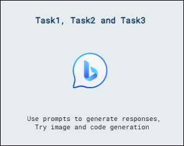

# Lab Scenario Preview: AI-900: Explore generative AI with Bing

## Lab 5: Explore generative AI with Bing

### Lab overview
In this lab, you will learn about generative AI, a technology that can create content such as text, images.

## Objectives
  
After completing this lab, you will be able to:
- Use AI with Bing Copilot prompts to generate responses
- Try image generation using AI with Bing Copilot
- Try code generation using AI with Bing Copilot

## Architecture Diagram

  
   
