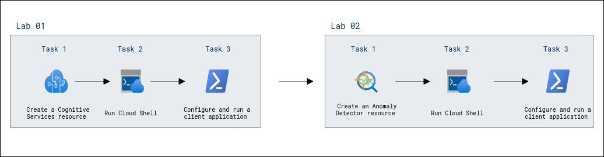

# Getting started with Azure AI services

### Overall Estimated Duration: 4 hours

## Overview

Azure AI services offer a comprehensive set of tools that allow you to integrate intelligent features into your applications, such as image recognition, text analysis, and language processing. With services like Azure AI Services, Azure Machine Learning, and Azure OpenAI, you can leverage advanced AI capabilities to streamline workflows, solve complex problems, and enhance the functionality of your applications. These services enable you to build powerful AI-driven solutions, making it easier to address real-world challenges and drive innovation in the cloud.

## Objective

This lab is designed to equip participants with hands-on experience in exploring Azure AI services, such as Computer Vision and Azure AI Services, to enhance applications with capabilities like image recognition, text analysis, and speech processing.

-   **Explore Computer Vision :** Implement a Azure AI Services resource to analyze images using the Computer Vision service. Configure and run a client app to extract captions, objects, and tags for visual insights.
-   **Explore Custom Vision :** Azure AI’s Custom Vision service allows you to build and deploy image recognition models tailored to your needs. It supports image classification and object detection, enabling you to label images, train models, and test their accuracy without requiring machine learning expertise.
-   **Explore Azure AI Face API :** Azure AI’s Face API provides advanced algorithms for detecting, recognizing, and analyzing human faces in images. It supports various functionalities such as face detection, verification, identification, and grouping, making it useful for applications like identity verification, touchless access control, and privacy protection through automatic face blurring.
-   **Explore Azure AI Translator :** Azure AI Translator is a cloud-based neural machine translation service that enables you to translate text and documents across more than 100 languages using a simple REST API call. It supports various use cases, such as real-time translation for call centers, multilingual conversational agents, and in-app communication.

## Prerequisites

Participants should have the following prerequisites:

-   **Basic Understanding of Cloud Computing :** Familiarity with fundamental cloud concepts and services, particularly in the context of Microsoft Azure.
-   **Knowledge of Azure AI Services :** Understanding of the Azure AI Services suite, including how to provision and use services like Computer Vision, Custom Vision, Azure AI Translator and Azure AI Face.
-   **Experience with the Azure Portal**: Proficiency in navigating and using the Azure Portal to manage and configure cloud resources.
-   **Familiarity with PowerShell or Cloud Shell :** Basic knowledge of using PowerShell or Cloud Shell for running commands and scripts within Azure.
-   **Basic Programming Knowledge :** Understanding of scripting or programming languages like PowerShell, which are used for configuring and running client applications in Azure.
-   **Understanding of APIs and Endpoints :** Familiarity with how to interact with APIs and use endpoints for connecting to services in Azure.
-   **Knowledge of Security Best Practices :** Awareness of security principles related to cloud services, including handling keys, authentication, and securing resources.

## Architechture

The lab architecture leverages a range of Microsoft Azure services and tools to provide hands-on experience with cloud computing, AI, and security practices. Using the Azure Portal, users can provision and manage resources like **Azure AI Services**, which include **Computer Vision**, **Custom Vision**, **Face API**, and **Translator**. PowerShell or Cloud Shell is used to execute scripts for provisioning and managing these resources. The lab encourages interaction with APIs and endpoints to connect client applications with Azure services, enabling real-time data processing and analysis. Additionally, a focus on security best practices ensures proper handling of authentication, keys, and resource protection. Participants will build, deploy, and test AI models and applications for various use cases, such as image recognition, face detection, and language translation, while developing a deeper understanding of cloud architecture, AI tools, and secure cloud operations..

## Architechture Diagram

## Explanation of Components

The architecture for this lab involves several key components:

-   **Computer Vision :** Provides image analysis capabilities, including object detection, text extraction, and image tagging.
-   **Azure Resource Group :** A container that organizes and manages Azure resources, including Cognitive Services, for efficient deployment and scaling.
-   **Azure Blob Storage :** Stores images or time-series data, providing scalable storage for input data used by the AI services.

## Getting Started with Lab

Welcome to your Getting started with Azure AI services Lab! We've prepared a seamless environment for you to explore and learn about Azure services. Let's begin by making the most of this experience:

## Accessing Your Lab Environment
 
Once you're ready to dive in, your virtual machine and **Lab Guide** will be right at your fingertips within your web browser.

     

### Virtual Machine & Lab Guide
 
Your virtual machine is your workhorse throughout the workshop. The lab guide is your roadmap to success.
 
## Exploring Your Lab Resources
 
To get a better understanding of your lab resources and credentials, navigate to the **Environment** tab.

 
## Utilizing the Split Window Feature
 
For convenience, you can open the lab guide in a separate window by selecting the **Split Window** button from the Top right corner.
 
   
 
## Managing Your Virtual Machine
 
Feel free to start, stop, or restart your virtual machine as needed from the **Resources** tab. Your experience is in your hands!
 

 
## Let's Get Started with Azure Portal
 
1. On your virtual machine, click on the Azure Portal icon as shown below:
 
    
 
1. You'll see the **Sign into Microsoft Azure** tab. Here, enter your credentials:
 
   - **Email/Username:** <inject key="AzureAdUserEmail"></inject>
 
      
 
3. Next, provide your password:
 
   - **Password:** <inject key="AzureAdUserPassword"></inject>
 
      

1. If you see the pop-up Action Required, click **Ask Later**.

   

   >**NOTE:** Do not enable MFA, select **Ask Later**.
 
1. If you see the pop-up **Stay Signed in?**, click **No**.

   

1. If you see the pop-up **You have free Azure Advisor recommendations!**, close the window to continue the lab.

1. If a **Welcome to Microsoft Azure** popup window appears, click **Cancel** to skip the tour.

## Support Contact
 
The CloudLabs support team is available 24/7, 365 days a year, via email and live chat to ensure seamless assistance at any time. We offer dedicated support channels tailored specifically for both learners and instructors, ensuring that all your needs are promptly and efficiently addressed.

Learner Support Contacts:
- Email Support: cloudlabs-support@spektrasystems.com
- Live Chat Support: https://cloudlabs.ai/labs-support

Now, click on **Next** from the lower right corner to move on to the next page.

### Happy Learning!!

