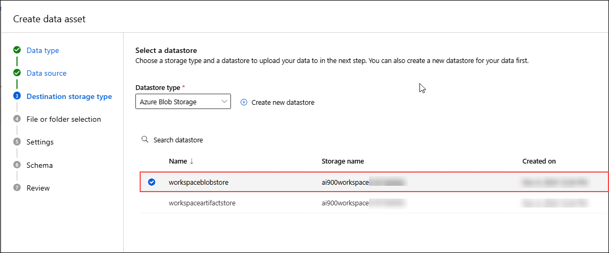
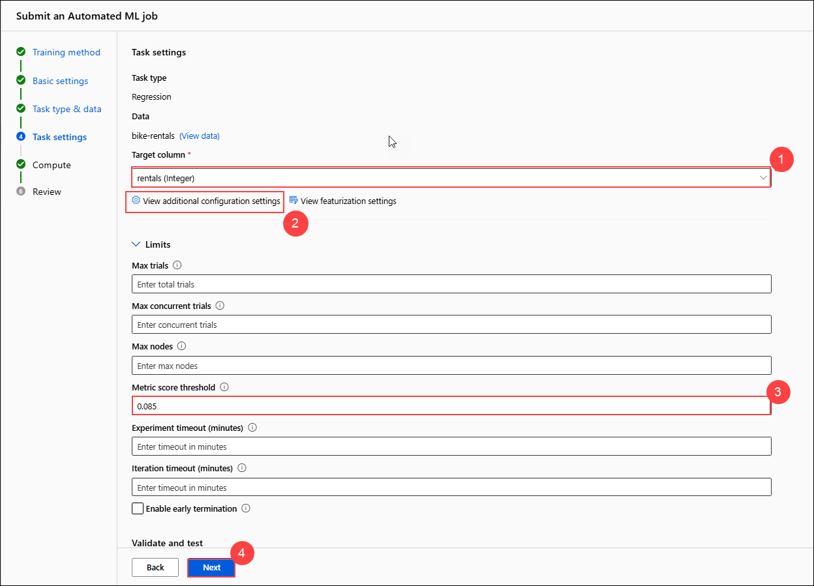

# Hands-on Lab: Explore Automated Machine Learning in Azure ML

## Lab scenario

The model will use a dataset of historical bicycle rental details to predict the number of rentals expected on a given day. It leverages seasonal and meteorological features to enhance the accuracy of its forecasts

## Lab objectives

In this lab, you will complete the following tasks:

- Task 1: Create an Azure Machine Learning workspace
- Task 2: Create compute
- Task 3: Create a dataset
- Task 4: Run an automated machine learning job
- Task 5: Review the best model
- Task 6: Deploy a predictive service
- Task 7: Test the deployed service

## Estimated time: 60 minutes

## Exercise 1: Create an Azure Machine Learning workspace  

### Task 1: Create an Azure Machine Learning workspace

1. Select **+ Create a resource**, search for Machine Learning.

    

1. In the Marketplace page search for **Azure Machine Learning** and Select **Azure Machine Learning**.
 
    

1. On **Azure Machine Learning** Page Click on **Create**.

   
   
1. create a new **Azure Machine Learning** resource with an *Azure Machine Learning* plan. Use the following settings:

    - **Subscription**: *Use the existing Azure subscription*
    - **Resource group**: Select **AI-900-Module-02-<inject key="DeploymentID" enableCopy="false"/>**
    - **Workspace name**: Enter **ai900workspace-<inject key="DeploymentID" enableCopy="false"/>**
    - **Region**: Select **<inject key="location" enableCopy="false"/>**
    - **Storage account**: *Note the default new storage account that will be created for your workspace*
    - **Key vault**: *Note the default new key vault that will be created for your workspace*
    - **Application insights**: *Note the default new application insights resource that will be created for your workspace*
    - **Container registry**: None (*one will be created automatically the first time you deploy a model to a container*)

   

1. Select **Review + create**.
1. After successfully completing the validation process, click on the **Create** button located in the lower left corner of the page.
   
1. Wait for deployment to complete, and then click on the **Go to resource** button, this will take you to your workspace resource.

1. Select **Launch studio** (or open a new browser tab and navigate to [https://ml.azure.com](https://ml.azure.com?azure-portal=true), and sign into Azure Machine Learning studio using your Microsoft account).

1. Close any messages that are displayed.

1. In Azure Machine Learning studio, you should see your newly created workspace. If that is not the case, select your Azure directory in the left-hand menu. Then from the new left-hand menu select **Workspaces**, where all the workspaces associated to your directory are listed, and **select the one you created for this exercise**.

### Task 2: Create compute

1. In [Azure Machine Learning studio](https://ml.azure.com?azure-portal=true), select the **&#8801;** icon (a menu icon that looks like a stack of three lines) at the top left to view the various pages in the interface (you may need to maximize the size of your screen). You can use these pages in the left hand pane to manage the resources in your workspace. Select **Compute**(under **Manage**).
 
1. On the **Compute** page, select the **Compute clusters** tab and to add a new compute cluster, click on **+ New** with the following settings. You'll use this to train a machine learning model:
 
      
    - **Location**: Select <inject key="location" enableCopy="false" />
    - **Virtual machine tier**: Dedicated
    - **Virtual machine type**: CPU
    - **Virtual machine size**:
        - Choose **Select from all options**
        - Search for and select **Standard_DS11_v2**
    - Select **Next**
      
    - **Compute name**: Enter **ai900compute-<inject key="DeploymentID" enableCopy="false"/>**
    - **Minimum number of nodes**: 0
    - **Maximum number of nodes**: 2
    - **Idle seconds before scale down**: 120
    - **Enable SSH access**: keep it as default
    - Select **Create**
 
       
> **Note**:The compute cluster will take some time to be created. You can move onto the next step while you wait.

### Task 3: Create a dataset

1. Download the zip file from the link [https://aka.ms/bike-rentals](https://aka.ms/bike-rentals?azure-portal=true) in your web browser and extract the file.
 
   
 
1. In [Azure Machine Learning studio](https://ml.azure.com?azure-portal=true), expand the left pane by selecting the menu icon at the top left of the screen. View the **Data** page (under **Assets**). The Data page contains specific data files or tables that you plan to work with in Azure ML. You can create datasets from this page as well.
 
1. On the **Data** page, under the **Data assets** tab, select **+ Create**. Then configure a data asset with the following settings:
    * **Data type**:
        * **Name**: bike-rentals
        * **Description**: Bicycle rental data
        * **Type**: Tabular
    * Click on **Next**.
 
          
 
    * **Data source**: From local files.
    * Click on **Next**.
    * In the **Select a datastore** pane, make sure that **workspaceblobstore** is selected and click on **Next**.
      
 
    * In the **Choose a file or folder** pane, select **Upload files or folder** and select the **Upload file**.
    * Now, open the extracted **bike-data** folder and select the **.csv** file.
 
      
 
    * Click on **Next**.
 
    * **Settings**:
        * **File format**: Delimited
        * **Delimiter**: Comma
        * **Encoding**: UTF-8
        * **Column headers**: Only first file has headers
        * **Skip rows**: None
        * **Dataset contains multi-line data**: *do not select*
    * Click on **Next**.
 
    * **Schema**:
        * Include all columns other than **Path**
        * Review the automatically detected types
    * Click on **Next**.
 
    * **Review**
        * Select **Create**
 
1. After the dataset has been created, open it and view the **Explore** page to see a sample of the data. This data contains historical features and labels for bike rentals.
 
> **Citation**: *This data is derived from [Capital Bikeshare](https://www.capitalbikeshare.com/system-data) and is used in accordance with the published data [license agreement](https://www.capitalbikeshare.com/data-license-agreement)*.

### Task 4: Run an automated machine learning job

Follow the next steps to run a job that uses automated machine learning to train a regression model that predicts bicycle rentals.

1. In [Azure Machine Learning studio](https://ml.azure.com?azure-portal=true), expand the left pane by selecting the menu icon at the top left of the screen. View the **Automated ML** page (under **Authoring**).

1. Click on **+ New Automated ML job**. Create an Automated ML job with the following settings:

      

    - **Basic settings**:
        - **Job name**: bike-rentals (1)
        - **New experiment name**: mslearn-bike-rental (2)
    - Click on **Next** (3).
      
       
      
    - **Task type & data**: 
        - **Task type**: Regression *(the model predicts a numeric value).
        - **Select data**: Select **bike-rentals**.
     - Click on **Next**.
        
    - **Task settings**:
        - **Target column**: rentals(Integer) (*this is the label that the model is trained to predict*)(1)
          
       
          
        - Select **Additional configuration settings:**(2)
        - **Primary metric**: Select **Normalized root mean squared error**
        - **Explain best model**: Selected — *this option causes automated machine learning to calculate feature importance for the best model which makes it possible to determine the influence of each feature on the predicted label.*
        - **Use all supported models**: Unselected. *You'll restrict the job to try only a few specific algorithms.*
        - **Allowed models**: *Select only **RandomForest** and **LightGBM** — normally you'd want to try as many as possible, but each model added increases the time it takes to run the job.*
        - Click on **Save**.

            

        - Expand **Limits**
            - **Metric score threshold**: 0.085 — *if a model achieves a normalized root mean squared error metric score of 0.085 or less, the job ends.*(3)
   
     - Click on **Next**(4).
          
    - **Compute**:
        - **Select compute type**: *Compute cluster*
        - **Select Azure ML compute cluster**: **ai900compute-<inject key="DeploymentID" enableCopy="false"/>**
     - Click on **Next** and Click on **Submit training job**
              
1. When you finish submitting the automated machine learning job details, it starts automatically. Wait for the status to change from *Preparing* to *Running*.

1. When the status changes to *Running*, view the **Models** tab and observe as each possible combination of training algorithm and pre-processing steps is tried and the performance of the resulting model is evaluated. The page automatically refreshes periodically, but you can also select **Refresh**. It might take 10 minutes or so before models start to appear, as the cluster nodes must be initialized before training can begin.

1. Wait for the job to finish. It might take a while — now might be a good time for a coffee break!

### Task 5: Review the best model

1. On the **Overview** tab of the automated machine learning job, note the best model summary.
    

    >**NOTE:**
    > You may see a message under the status "Warning: User specified exit score reached...". This is an expected message. Please continue to the next step.  
1. Select the text under **Algorithm name** for the best model to view its details.

1. Select the **Metrics** tab, use the arrows icon to expand the panel if it is not already expanded and select the **residuals** and **predicted_true** charts if they are not already selected. 

    

    Scroll down and review the charts which show the performance of the model. The first chart shows the *residuals*, the differences between predicted and actual values, as a histogram, the second chart compares the predicted values against the true values.

1. Select the **Explanations(preview)** tab. Select an Explanation ID and then select **Aggregate feature importance** tab. This chart shows how much each feature in the dataset influences the label prediction, like this:

    

### Task 6: Deploy a predictive service

1. In [Azure Machine Learning studio](https://ml.azure.com?azure-portal=true), on the **Automated ML** page, select your automated machine learning job.

1. On the **Overview** tab, select the algorithm name for the best model.

    

1. On the **Model** tab, select the **Deploy** button and use the **web service** option.

      
      
3. To deploy the model with the following settings and then click on **Deploy**.
    - **Name**: predict-rentals
    - **Description**: Predict cycle rentals
    - **Compute type**: Azure Container Instance
    - **Enable authentication**: Selected

       

1. Wait for the deployment to start - this may take a few seconds. Then, in the **Model summary** section, observe the **Deploy status** for the **predict-rentals** service, which should be **Running**. Wait for this status to change to **Succeeded**, which may take some time. You may need to select **Refresh** periodically.

1. In Azure Machine Learning studio, on the left hand menu, select **Endpoints**.

    

### Task 7: Test the deployed service

Now you can test your deployed service.

1. On the **Endpoints** page, open the **predict-rentals** real-time endpoint.

    

> **Note**: The realtime endpoint may be in unhealthy state, wait for another 30 minutes for the endpoint state to change the deployment state to **Healthy**, or else perform the steps from Task 5.

<validation step="2e4871a4-3e69-40a1-bbd1-dc026b54d5ac" />

### Summary

In this lab, you’ll create an Azure Machine Learning workspace, set up compute resources, register datasets, run automated ML jobs, review and deploy the best model, and test the deployed service.

### You have successfully completed this lab.
